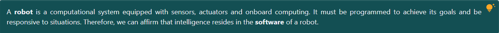

[Back to main README.][]

[Back to main README.]: ../README.md

# Index

- [Highlited Section](#highlitedSection)

<a name="highlitedSection"></a>
## Highlited Section

- **Definition**: *src/components/Theory/HighlitedSection.tsx*
- **Style file**: *src/components/Theory/HighlitedSection.styles.ts*
- **Parameters**: *NO PARAMETERS NEEDED*
- **Usage**: ```<HighlitedSection>Insert your text here</HighlitedSection>```

This component is a wrapper for a tag with its own style where the text written is highlited.

